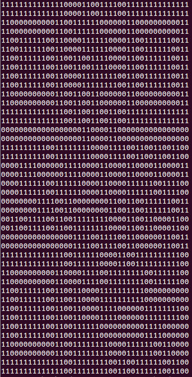

# BSidesWpg 2015 - Capture The Flag Puzzle

Congrats to Mark Campbell for [solving the puzzle first](https://twitter.com/Nitrodist/status/665994960550793216), his solution [is here](https://github.com/Nitrodist/bsideswpg-coin-puzzle).

Meanwhile here's my workthrough to the end:

Event coins with encrypted text on one side were handed out to some attendees, and contained the first clue for a capture the flag event.

 

The first thing worth noting is the vise image typically used in compression software logos, and the letters 'QR' inside it. It's seems safe to assume we're looking for a QR code that's been sliced and diced and turned into the text on the coin.

Typing up the four strings of characters isn't exactly a trivial task, as the font makes it difficult to distinguish between number `0` and uppercase letter `O`, and between number `1` and lowercase letter `l` (and uppercase letter `I` to some degree). There were a few people at the event who ran through every possible combination of letters, but you can get away without going that far if you look carefully enough, depending on the stamping quality of your coin.

Note: They're all zeros (luckily I assumed any letter O's would probably be rounder than any of the zeros present), and there is an extremely subtle difference between the 1's and l's that can be observed, where the vertical body of number 1's are only slightly thicker than the font's general stroke width.

Otherwise, there's no real reason to expect we'd need four separate strings at this stage, so I appended them into [coindata.txt](coindata.txt).

The character set suggests base64 encoding, which can be decoded with
`cat coindata.txt | base64 --decode > decoded`

[The decoded data is a bunch of non-text junk](decoded), no idea what it is. Let's check the hex values for something recognizable.

`cat decoded | hd`


Google says `78 9c` is a zlib header, which I suppose makes sense given the original vise image on the coin.

Since Ruby is my go-to for scripting, you can decompress with
```
require 'zlib'
decompressed = Zlib::Inflate.inflate(decoded)
```

*If decompression fails, you've probably misidentified some of the coin characters, check again.

[The decompressed data also reads as non-text junk](decompressed.mp2). But calling 'file decompressed' reveals:
`decompressed: MPEG ADTS, layer II, v1,  56 kbps, 44.1 kHz, Monaural`

*It's at this point that I spent a lot of time meddling with sonic visualizations, checking waveform patterns, reading up on mp2 audio, up until it was announced that someone had finished the puzzle, and there were no audio files. There mp2 characteristics are only a coincidence.


Looking back to the initial clues on the coin, we know that we've already handled the vise's decompression, and all that's left is to generate a qr code. Sounds simple, right? It is. The decompressed data is literally pixel bits of the image.

```
bits = decompressed.each_byte.map { |b|
    puts b.to_s(2) << " " << b.to_s(2).rjust(8,'0')
    b.to_s(2).rjust(8,'0')
}.join
```

[1768 bits in all](bits.txt), but since QR codes are square, and sqrt(1768) = 42.xxx, we can generate a preview by breaking it up into rows of 42 chars.

`bits.scan(/.{42}/).map { |b| puts b}`



From there we can see qr tracking squares in the corners of the generated image, and we know it's a qr code.

I ended up simply [converting the bits to html](qrcode.html) since it's simple to fudge around with.


Scanning the QR code returns the flag!

`flag::triangular_flag_on_post::soon::computer:` or 

That's it!

My overall Ruby solution file [can be found here](solve.rb).
If you have ruby installed, calling `ruby solve.rb` will generate all the data files along the way.
